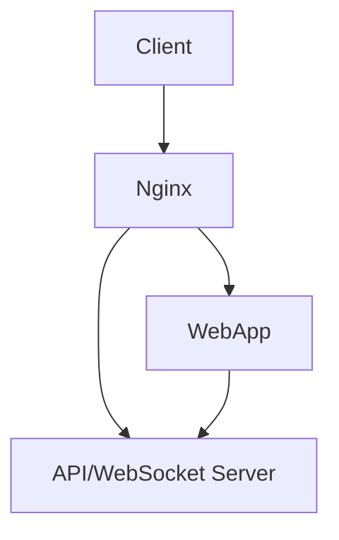

# WebRTC Video Streaming Platform

A robust real-time video streaming platform built with WebRTC, React, and Socket.IO, featuring comprehensive development tools and infrastructure automation.

## Table of Contents
- [Architecture](#architecture)
- [Features](#features)
- [Prerequisites](#prerequisites)
- [Development](#development)
- [Deployment](#deployment)
- [Testing](#testing)
- [Infrastructure](#infrastructure)
- [Command Reference](#command-reference)

## Architecture

The application consists of four main components:
- **Nginx**: Reverse proxy and SSL termination
- **Web App**: React frontend application
- **API Server**: Node.js/Express backend server



## Features

### Client-Side
- **Live Video Broadcasting**: Create rooms and broadcast video streams
- **Multiple Viewer Support**: Multiple users can join a room and view broadcasts
- **Real-time Communication**: Built on WebRTC for low-latency streaming
- **Mobile-Optimized**: 9:16 aspect ratio perfect for mobile/vertical video
- **Picture-in-Picture**: Support for PiP mode while broadcasting

### Server-Side
- **Robust Error Handling**: Comprehensive error logging and management
- **Health Monitoring**: Built-in health check endpoints
- **Graceful Shutdown**: Proper cleanup of resources on server shutdown
- **Database Migrations**: Automated database schema management
- **Seeding Support**: Development data seeding

## Prerequisites

### Required Tools
- Docker and Docker Compose
- Make
- Git
- Modern web browser with WebRTC support

### System Requirements
- Docker: 4GB+ memory allocation
- Available ports: 443, 8000, 9222, 9229, 27017
- Storage: 10GB+ recommended

## Development

### Quick Start

1. Clone the repository:
```bash
git clone <repository-url>
cd <project-directory>
```

2. Start development environment:
```bash
make up
```
Access to address https://0.0.0.0 in browser

3. View logs:
```bash
make logs SERVICE=webapp  # or server
```

### Development Commands

#### Environment Management
```bash
# Start development environment
make up

# Start production environment
make up ENV=production

# Stop environment
make down

# Restart specific service
make restart SERVICE=webapp

# View logs
make logs SERVICE=server
```

#### Testing
```bash
# Run all tests
make test-all

# Run specific test suites
make run-unit-tests
```

#### Code Quality
```bash
# Run linters
make lint
```

### Container Management
```bash
# Shell access to containers
make shell SERVICE=webapp

# View running containers
make ps

# Clean up resources
make prune
```

## Deployment

### Production Deployment

1. Configure environment:
```bash
cp .env.example .env
# Edit .env with production values
```

2. Deploy:
```bash
make up ENV=production
```

### Infrastructure Management

#### Terraform Commands
```bash
# Initialize Terraform
make tf-init

# Plan changes
make tf-plan

# Apply changes
make tf-apply

# Destroy infrastructure
make tf-destroy

# Access Terraform shell
make tf-shell
```

## Testing

### Test Suites

1. **Unit Tests**
```bash
make run-unit-tests
```
## Configuration

### Environment Variables

#### Web App
```env
NODE_ENV=development|production
```

#### Server
```env
NODE_ENV=development|production
PORT=3001
HOST=0.0.0.0
LOG_LEVEL=debug|info
```

## Monitoring and Debugging

- **Logs**: `make logs SERVICE=<service-name>`
- **Health Checks**: Automated monitoring for all services
- **Chrome DevTools**: Port 9222
- **Node.js Debugger**: Port 9229

## Known Limitations

- Picture-in-Picture aspect ratio may not be preserved in all browsers
- STUN server is using Google's public server (consider using your own TURN server for production)
- Browser support for WebRTC features may vary

## Command Reference

For a complete list of available commands:
```bash
make help
```

Output includes:
- Docker Compose commands
- Application commands
- Terraform commands
- Utility commands

## Contributing

1. Fork the repository
2. Create a feature branch (`git checkout -b feature/amazing-feature`)
3. Run tests (`make test-all`)
4. Commit your changes (`git commit -m 'Add amazing feature'`)
5. Push to the branch (`git push origin feature/amazing-feature`)
6. Open a Pull Request

## Support

For issues and feature requests, please open an issue in the GitHub repository.